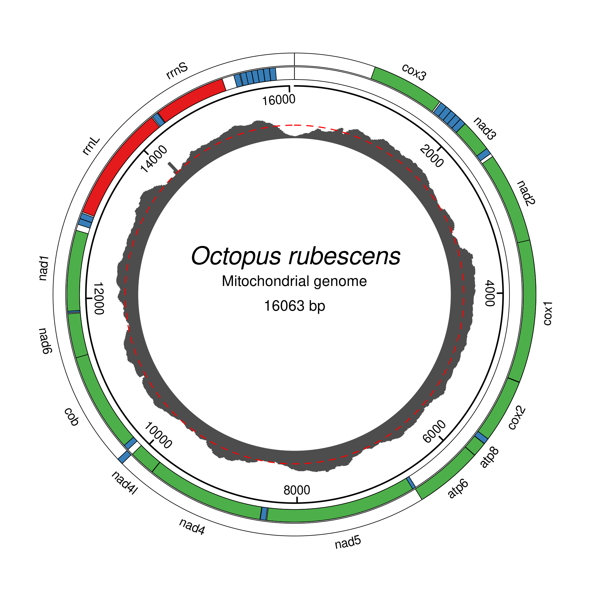

<!-- README.md is generated from README.Rmd. Please edit that file -->

```{r, include = FALSE}
knitr::opts_chunk$set(
  collapse = TRUE,
  comment = "#>",
  fig.path = "man/figures/README-",
  out.width = "100%"
)
```

# mitoPlotR

<!-- badges: start -->
<!-- badges: end -->

mitoPlotR is an R package for visualization and exploratory analysis of mitochondrial genomes, with a focus on metazoan
mitogenomes and MITOS2 annotation workflows

## Installation

You can install the development version of mitoPlotR from [GitHub](https://github.com/) with:

``` r
# install.packages("pak")
pak::pak("KirtOnthank/mitoPlotR")
```

## Example

This is a basic example which shows you how to solve a common problem:

```{r example, eval=F}
library(mitoPlotR)

plot_mitogenome(
  gff_file = system.file("extdata", "example.gff", package = "mitoPlotR"),
  fasta_file = system.file("extdata", "example.fasta", package = "mitoPlotR"),
  depth_file = system.file("extdata", "example.depth.txt", package = "mitoPlotR"),
  output_file = "example_plot.png",
  species_name = "Octopus rubescens"
)
```


## Example output


